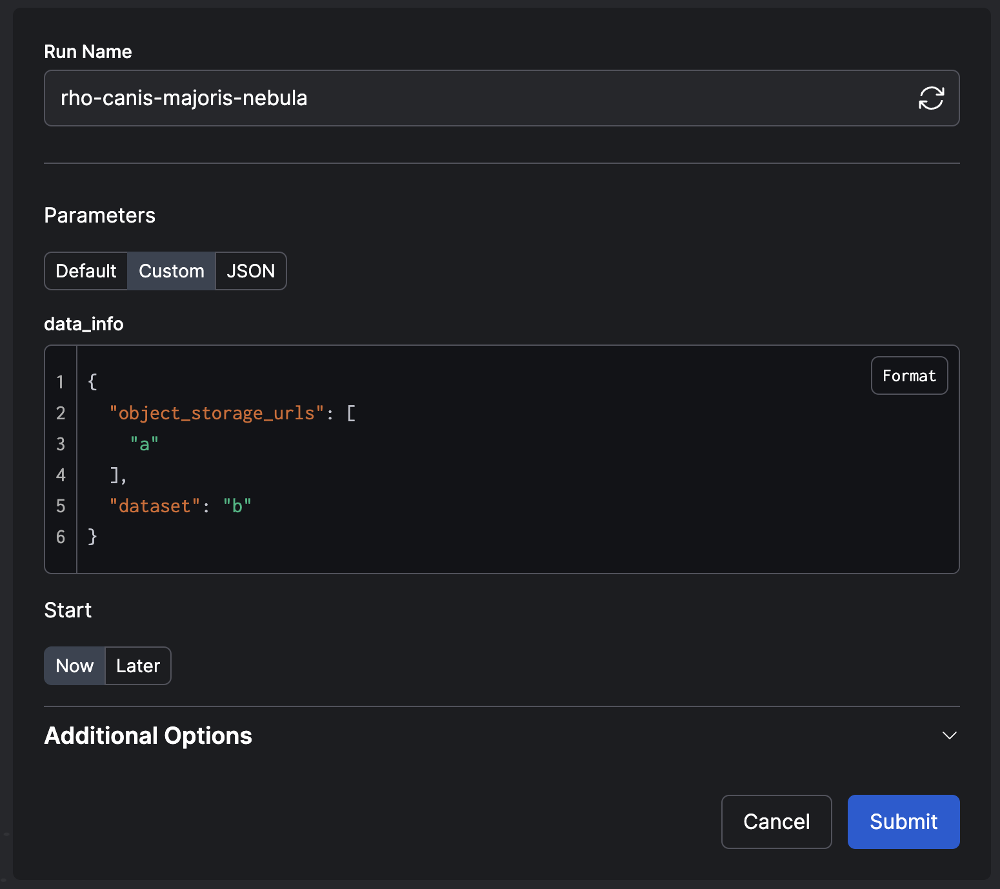

# GPS: grpc-prefect-snippet

## 테스트 환경

- Macbook Pro M1 / **python 3.9**
- Macbook Pro M1 / **python 3.11**

## 사용 가이드

1. 가상환경을 준비하고 활성화한 다음 `make install` 명령을 실행합니다.
2. 프로그램을 실행합니다.

`터미널1`
```bash
python3 -m gps.server.a.main
```

`터미널2`
```bash
python3 -m gps.server.b.main
```

`터미널3`
```bash
python3 -m gps.client.main
```

`터미널4`
```bash
prefect server start
```

## `Makefile` 이용 팁

`Makefile` 은 다음과 같은 기능을 가지고 있습니다.

- `make lint`
    - 린터는 구글 스타일 가이드 `pylintrc`를 `pylint`에 물려 사용합니다.
    - `.vscode` 설정을 사용하려면 `pylint` 익스텐션을 설치하세요.
- `make test` (테스트는 `unittest`를 사용합니다.)
    - `test_*.py` 와 `*_test.py` 패턴을 모두 지원합니다.
    - 테스트 파일이 존재하는 위치까지 `__init__.py` 로 연결되어 있어야 합니다.
- `make format`
    - 포매터는 google의 `yapf`를 사용합니다.
    - `yapf` 포매터의 기본 세팅에 `.style.yapf` 파일에 명시된 옵션을 오버라이딩해 코드를 포매팅합니다.
    - `.vscode` 설정을 사용하려면 `yapf` 익스텐션을 설치하세요.
- `make proto`
    -  `grpc_tools.protoc`와 `betterproto` 플러그인으로 grpc 통신에 필요한 파이썬 파일을 생성합니다.
- `make clean`
    - `make proto` 명령을 실행하며 `grpc_tools.protoc`가 자동으로 생성한 파이썬 파일들을 삭제합니다.

## 개발 주의사항

### `pydantic` 을 둘러싼 불안정 이슈

- `prefect` 은 아직 `betterproto` 가 생성한 `pydantic` 기반 데이터클래스와 잘 호환되지 않는다는 문제가 있습니다.
- 현재 저장소에 고정되어 있는 버전들은 한마디로 '아주 겨우겨우 끼워맞추어' 둔 상태라고 할 수 있습니다.
- 미래에 `pydantic` 의 버전, `betterproto` 의 버전, `prefect` 의 버전을 조금 더 신경써야 할 필요가 있습니다.
- 이 문제가 어떤 라이브러리의 책임인지는 명확하게 알 수 없지만, 다음과 같이 몇 가지를 짐작해볼 수 있습니다.

1. `betterproto` (v2, beta) 는 `pydantic` 을 지원하기 시작했으나, 2024년 1월 기준 `pydantic` v2 를 지원하지 않습니다. ([betterproto issue](https://github.com/danielgtaylor/python-betterproto/issues/530))
2. 이론상 `prefect` (2.14.16) 은 `pydantic` v1, v2 모두를 지원해야 합니다. 하지만 2024년 1월 기준 `pydantic` v2 를 사용하면 `pydantic` 또는 내장 `dataclass` 의 데이터클래스를 이용해 정의되어 배포(deploy)된 플로우(flow)를 웹 UI나 CLI를 이용해 json 포맷에 값을 담아 실행시킬 때 작동하지 않습니다. 쉽게말해 `prefect` 2.14.16 에서는 `pydantic` v2 지원이 불안정합니다. ([prefect issue #11632](https://github.com/PrefectHQ/prefect/issues/11632), [prefect issue #11656](https://github.com/PrefectHQ/prefect/pull/11656))

어떤 부분에서 문제가 생기는 것일까요? 예를 들어 아래 코드 조각에서 `DataInfo` 와 같이 파이썬 원시 타입이 아닌 데이터클래스를 이용해 입력 형식이 정의된 플로우가 있다고 할 때,

```python
@dataclass(eq=False, repr=False)
class DataInfo(betterproto.Message):
    object_storage_urls: List[str] = betterproto.string_field(1)
    dataset: str = betterproto.string_field(2)

@prefect.flow
def server_flow(data_info: DataInfo) -> Response: 
    ...

# ...

server_flow.serve(name="PrefectDeployer")
```

플로우가 `serve` 메서드로 배포된다면 아래와 같이 CLI로 실행시키거나, 동일한 작업을 web UI로 실행시킬 수 있습니다. 그것이 `prefect` 의 강점이니까. 끄덕.

```bash
prefect deployment run server-flow/MyPrefectDeployer --param data_info='{"object_storage_urls": ["a"], "dataset": "b"}'
```



하지만 이들은 정상적으로 동작하지 않습니다. CLI나 web UI로 넘겨받은 json을 바탕으로 데이터클래스 파이썬 객체에 값을 다시 담을 수 없어서 발생하는 문제입니다. 언젠간 고쳐지겠지만, 2024년 1월 기준 다음과 같은 방법을 선택하기로 했습니다. 이 경우 문제없이 동작합니다.

1. `betterproto` 에서 `pydantic` 을 활성화하지 않는다. (python 표준 데이터클래스를 사용)
2. `prefect` 에서 `pydantic` v1 을 사용하도록 버전을 고정한다.
