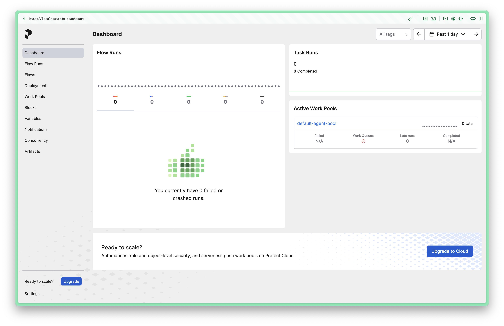
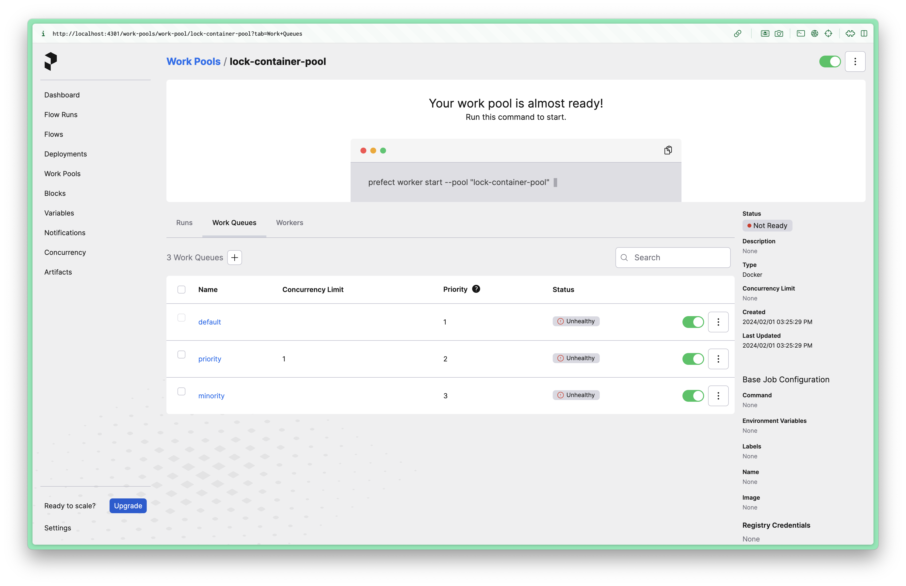
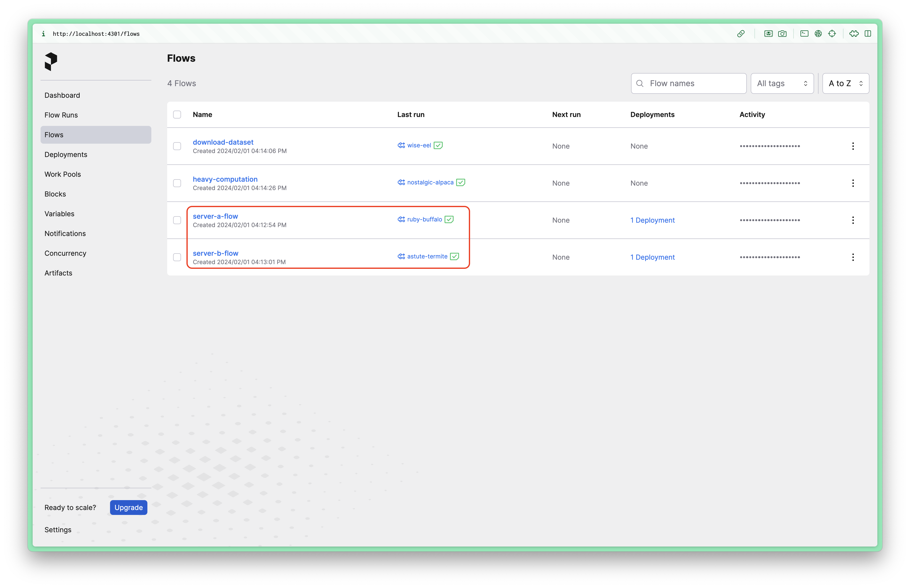
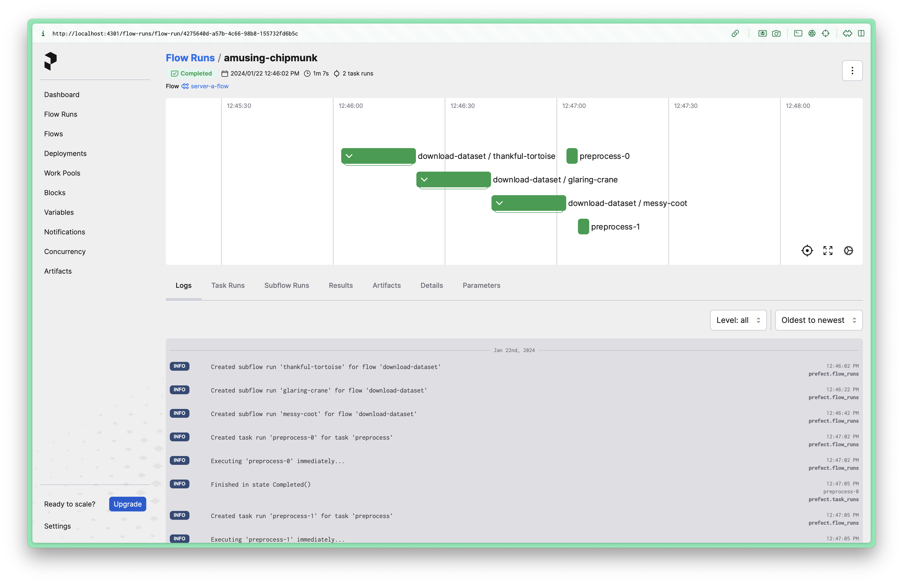
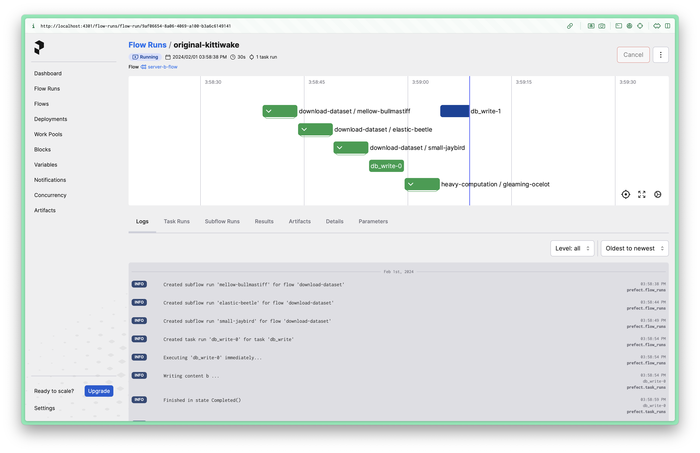
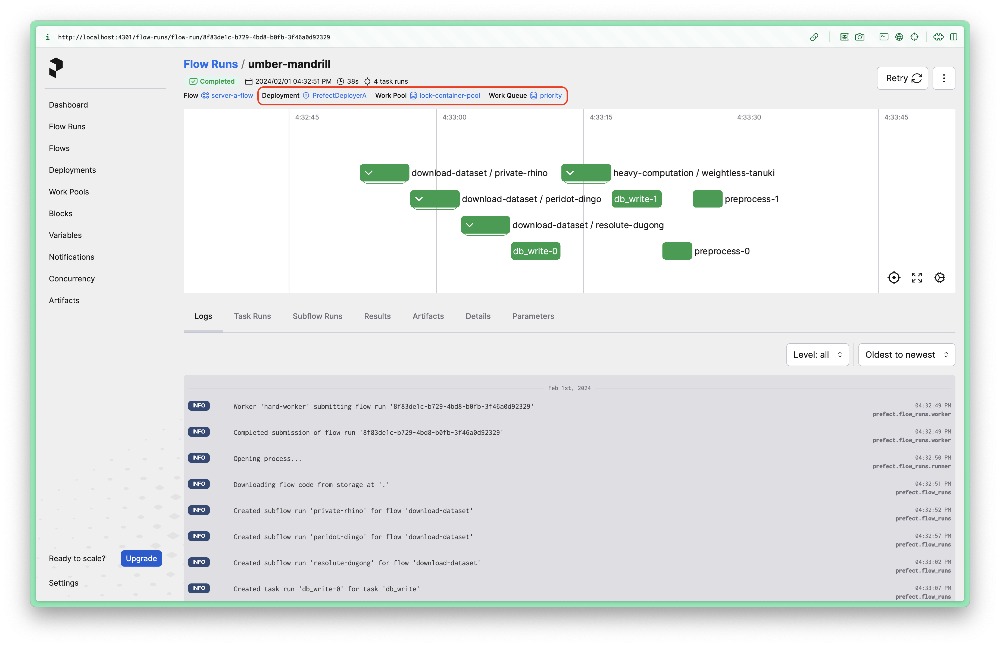
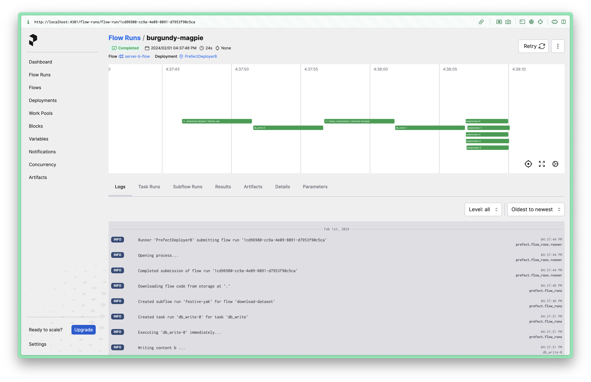

# GPS: grpc-prefect-snippet

- `prefect` 는 빠르게 발전하고 있는 워크플로 오케스트레이션 도구입니다. 추상적으로 바라본다면 `Airflow`, `Dagster`, `Argo-workflow` 와 비슷한 계위에 놓여 있다고 생각할 수 있습니다.
- `prefect` 는 보일러플레이트가 적고 파이썬 친화적입니다. DAG을 강요하지 않는다는 장점이 있습니다. 워크플로는 클라우드, 쿠버네티스같이 접근 허들이 높은 환경뿐 아니라 로컬 환경이나 로컬 도커, 관리형 클라우드같이 접근이 쉬운 환경에서 차근차근 개발해나갈 수 있도록 설계되었습니다. 따끈따끈한 소프트웨어에 걸맞게 깔끔하고 직관적인 웹 대시보드를 제공하는 것도 장점 중 하나입니다.
- 한편 빠르게 발전하고 있는 소프트웨어인만큼, 한국 사용자 레퍼런스가 적고 버그와 정상 작동의 경계가 모호해 사용이 꽤나 까다롭습니다.
- 특히 다른 통신 시스템 및 오케스트레이션 도구 (이를테면 `grpc`, `docker`, `docker compose` 등...) 들과 결합되면 그 고민은 훨씬 깊어지는 것 같습니다.
- 이미 잘 작동하는 것이 확인된 작은 소스 코드 조각들로부터 천천히 테스트하며 수정하고 확장해 나가기를 추천합니다. 이 저장소가 고민의 시작점이 되기를 바랍니다.
- 같이 사용 사례를 누적해 나가면서 이슈 대응해 나가면 좋겠습니다. 🤪

## 테스트 환경

- Ubuntu 20.04 (x86) / **python 3.8**
- Macbook Pro M1 / **python 3.9**
- Macbook Pro M1 / **python 3.11**

# 튜토리얼

- `prefect` 를 이용해 워크플로를 오케스트레이션하는 방법은 다양합니다.
- 각각의 방법마다 코드 조각을 실행하는 방법을 하나씩 안내합니다.
- 조금씩 사용 사례를 누적해 나갈 예정입니다.

### 코드 아웃라인

|    서버   | 기능 | 개발현황 |
|:--------:|:---:|:------:|
|  a.main_grpc  | `server_a_flow` 함수를 실행하는 50051번 포트의 grpc 서버 |  ✅  |
|  a.main_serve  | `server_a_flow` 함수를 실행하는 50051번 포트의 grpc 서버 |  ✅  |
|  b.main  | `server_b_flow` 함수를 실행하는 50052번 포트의 grpc 서버 + `prefect API` 에 응답하는 서버 |  ✅  |

### 용어 정리

- 일거리 풀: work pool
- 플로우: flow
- 작업: task
- 노동자: worker

## 공통 주의사항

- 모든 터미널의 가상환경을 잊지 맙시다.
- 터미널에 노출된 주소에 들어가 접속상태를 확인합니다.
- 작동하지 않는다면 `envs/network.env` 에 명시된 포트를 바꾸어 봅니다.

## 시나리오 #1

`grpc` 서버 `a`에서 `prefect` 플로우를 실행합니다. 플로우 함수는 `python-betterproto` 를 이용해 만들어진 데이터클래스를 인자로 사용합니다.

1. 가상환경을 준비하고 활성화합니다.
2. `make install` 명령을 실행합니다.
3. 아래 명령들을 실행합니다.

`터미널1` - `prefect` 서버 실행
```bash
make prefect-server
```



`터미널2` - 서버 `a`
```bash
python3 -m gps.server.a.main_grpc
```

`터미널3` - `grpc` 클라이언트
```bash
python3 -m gps.client.scenarios.s1
```

2/20 작동 테스트 완료

## 시나리오 #2

서버 `b`에서 `prefect` 플로우를 실행합니다. 서버 `b`의 플로우는 `grpc`를 통해 실행되는 것도 가능하고, `prefect API`를 통해 실행되는 것도 가능하도록 작성되어 있습니다. 각 서버의 특징을 한눈에 비교하려면 위 표를 참고하세요. 이번에도 마찬가지로 플로우 함수는 `python-betterproto` 를 이용해 만들어진 데이터클래스를 인자로 사용합니다.

1. 가상환경을 준비하고 활성화합니다.
2. `make install` 명령을 실행합니다.
3. 아래 명령들을 실행합니다.

`터미널2` - 서버 `b`
```bash
python3 -m gps.server.b.main
```

`터미널3` - `grpc` 클라이언트
```bash
python3 -m gps.client.scenarios.s2_1
```

`터미널3` - `prefect API` 클라이언트 (python API, CLI)
```bash
python3 -m gps.client.scenarios.s2_2
```

2/21 작동 테스트 완료

## 시나리오 #3

서버 `a`에서 `prefect` 플로우를 일거리 풀(work pool)의 일거리 큐(work queue)에 등록하고, 노동자(worker)를 이용해 실행합니다.

- NOTE: 이들의 개념이 더 궁금하면 다음 글들을 참고하세요.
  - https://docs.prefect.io/latest/tutorial/work-pools/
  - https://docs.prefect.io/latest/tutorial/workers/
  - https://docs.prefect.io/latest/concepts/work-pools/

1. 가상환경을 준비하고 활성화합니다.
2. `make install` 명령을 실행합니다.
3. 아래 명령들을 실행합니다.

### 서버

`터미널2` - 프로세스 일거리 풀과 작업 큐 생성
```bash
# 일거리 풀을 생성합니다.
prefect work-pool create lock-pool --type process

# 하나의 일거리 풀에 두 개의 일거리 큐를 생성합니다.
# 하나는 높은 우선순위를 가지고 동시작업을 금지하는 큐
# 다른 하나는 낮은 우선순위를 가지고 동시작업을 허용하는 큐
prefect work-queue create priority --pool lock-pool --priority 2 --limit 1
prefect work-queue create minority --pool lock-pool --priority 3

# 노동자를 배정합니다.
prefect worker start --name hard-worker --pool lock-pool --work-queue priority
```

`터미널3` - 서버 `a`
```bash
python3 -m gps.server.a.main_deploy_process
```

NOTE: `process`를 이용한 시나리오는 아직 완전하지 않습니다. 왜 불안전한지 더 궁금하신 분들은 [prefect 이슈](https://github.com/PrefectHQ/prefect/issues/11597)와 [슬랙 커뮤니티](https://prefect-community.slack.com/archives/CL09KU1K7/p1704406865966729)를 참고하세요. 이는 2.15버전에 아직 머지되지 않았습니다. 곧 지원될 예정이지만, 그 전까지는 `docker`을 이용하는 아래 시나리오만 시도해 보세요.

NOTE: 실행 전, 로컬 환경에 도커(또는 도커 데스크톱)가 실행 중인지 확인하세요.

`터미널2` - 컨테이너 일거리 풀과 작업 큐 생성
```bash
prefect work-pool create lock-container-pool --type docker
prefect work-queue create priority --pool lock-container-pool --priority 2 --limit 1
prefect work-queue create minority --pool lock-container-pool --priority 3
prefect worker start --name hard-worker --pool lock-container-pool --work-queue priority
```

`터미널3` - 서버 `a`
```bash
python3 -m gps.server.a.main_deploy_docker
```



`터미널3` - `prefect API` 클라이언트 (python API)
```bash
python3 -m gps.client.scenarios.s3
```

# TODO 여기 아래로 아직 시나리오 작성 중

`터미널3` - 서버 a (grpc 서버)
```bash
python3 -m gps.server.a.main_grpc
```

`터미널4` - 서버 a (컨테이너 기반 일거리 풀 `lock-container-pool`의 `priority` 큐에 플로우 배포)
```bash
# NOTE: MacOS docker desktop 에서는 도커의 --network "host" 옵션이 적용되지 않습니다.
# 따라서, 이 경우에는 envs/network.env 의 `PREFECT_API_URL_IN_CONTAINERS` 가 "host.docker.internal" 인지 확인하세요.
# Ubuntu docker 에서는 `PREFECT_API_URL_IN_CONTAINERS` 가 `PREFECT_HOST` 와 동일해도 상관없습니다.
python3 -m gps.server.a.flows.main_deploy
```

`터미널5` - 노동자 (컨테이너 기반 일거리 풀 `lock-container-pool`을 처리함)
```bash
prefect worker start --name "hard-worker" --pool "lock-container-pool"
```

`터미널6` - 서버 b (grpc 서버 실행과 `flow.serve()` 를 동시에)
```bash
python3 -m gps.server.b.main
```

### 클라이언트

`터미널7` - grpc 클라이언트 (서버 a의 grpc 서버와 서버 b의 grpc 서버에 요청을 보냄)
```bash
python3 -m gps.client.main
```

- 서버 a 의 grpc 서버 터미널과 서버 b 의 터미널을 확인해보세요.
- 웹 UI를 확인해보세요.
- 실행을 마치기까지는 약간의 시간이 소요됩니다.








`터미널7` - prefect CLI 클라이언트 (서버 b의 `.serve()` 된 플로우를 실행함)
```bash
prefect deployment run 'server-a-flow/PrefectDeployerA' --param urls='["a", "b", "c"]'
```

- 서버 a 의 노동자 터미널을 확인해보세요.
- 웹 UI를 확인해보세요.



`터미널8` - prefect CLI 클라이언트 (서버 a의 `.deploy()` 된 플로우를 실행함)
```bash
prefect deployment run 'server-b-flow/PrefectDeployerB' --param data_info='{"object_storage_urls": ["a"], "dataset": "b"}'
```

- 서버 b 의 터미널을 확인해보세요.
- 웹 UI를 확인해보세요.




`FIXME`
```
# 2. 작업 레벨 동시성 제한 설정
prefect concurrency-limit create db-lock 1
```

## `Makefile` 이용 팁

`Makefile` 은 다음과 같은 기능을 가지고 있습니다.

- `make lint`
    - 린터는 구글 스타일 가이드 `pylintrc`를 `pylint`에 물려 사용합니다.
    - `.vscode` 설정을 사용하려면 `pylint` 익스텐션을 설치하세요.
- `make test` (테스트는 `unittest`를 사용합니다.)
    - `test_*.py` 와 `*_test.py` 패턴을 모두 지원합니다.
    - 테스트 파일이 존재하는 위치까지 `__init__.py` 로 연결되어 있어야 합니다.
- `make format`
    - 포매터는 google의 `yapf`를 사용합니다.
    - `yapf` 포매터의 기본 세팅에 `.style.yapf` 파일에 명시된 옵션을 오버라이딩해 코드를 포매팅합니다.
    - `.vscode` 설정을 사용하려면 `yapf` 익스텐션을 설치하세요.
- `make proto`
    -  `grpc_tools.protoc`와 `betterproto` 플러그인으로 grpc 통신에 필요한 파이썬 파일을 생성합니다.
- `make clean`
    - `make proto` 명령을 실행하며 `grpc_tools.protoc`가 자동으로 생성한 파이썬 파일들을 삭제합니다.

## 개발 주의사항

### `pydantic` 을 둘러싼 불안정 이슈

- `prefect` 은 아직 `betterproto` 가 생성한 `pydantic` 기반 데이터클래스와 잘 호환되지 않는다는 문제가 있습니다.
- 현재 저장소에 고정되어 있는 버전들은 한마디로 '아주 겨우겨우 끼워맞추어' 둔 상태라고 할 수 있습니다.
- 미래에 `pydantic` 의 버전, `betterproto` 의 버전, `prefect` 의 버전을 조금 더 신경써야 할 필요가 있습니다.
- 이 문제가 어떤 라이브러리의 책임인지는 명확하게 알 수 없지만, 다음과 같이 몇 가지를 짐작해볼 수 있습니다.

1. `betterproto` (v2, beta) 는 `pydantic` 을 지원하기 시작했으나, 2024년 1월 기준 `pydantic` v2 를 지원하지 않습니다. ([betterproto issue](https://github.com/danielgtaylor/python-betterproto/issues/530))
2. 이론상 `prefect` (2.14.16) 은 `pydantic` v1, v2 모두를 지원해야 합니다. 하지만 2024년 1월 기준 `pydantic` v2 를 사용하면 `pydantic` 또는 내장 `dataclass` 의 데이터클래스를 이용해 정의되어 배포(deploy)된 플로우(flow)를 웹 UI나 CLI를 이용해 json 포맷에 값을 담아 실행시킬 때 작동하지 않습니다. 쉽게말해 `prefect` 2.14.16 에서는 `pydantic` v2 지원이 불안정합니다. ([prefect issue #11632](https://github.com/PrefectHQ/prefect/issues/11632), [prefect issue #11656](https://github.com/PrefectHQ/prefect/pull/11656))

어떤 부분에서 문제가 생기는 것일까요? 예를 들어 아래 코드 조각에서 `DataInfo` 와 같이 파이썬 원시 타입이 아닌 데이터클래스를 이용해 입력 형식이 정의된 플로우가 있다고 할 때,

```python
@dataclass(eq=False, repr=False)
class DataInfo(betterproto.Message):
    object_storage_urls: List[str] = betterproto.string_field(1)
    dataset: str = betterproto.string_field(2)

@prefect.flow
def server_flow(data_info: DataInfo) ➡️ Response: 
    ...

# ...

server_flow.serve(name="PrefectDeployer")
```

플로우가 `serve` 메서드로 배포된다면 아래와 같이 CLI로 실행시키거나, 동일한 작업을 web UI로 실행시킬 수 있습니다. 그것이 `prefect` 의 강점이니까. 끄덕.

```bash
prefect deployment run server-flow/MyPrefectDeployer --param data_info='{"object_storage_urls": ["a"], "dataset": "b"}'
```


하지만 이들은 정상적으로 동작하지 않습니다. CLI나 web UI로 넘겨받은 json을 바탕으로 데이터클래스 파이썬 객체에 값을 다시 담을 수 없어서 발생하는 문제입니다. 언젠간 고쳐지겠지만, 2024년 1월 기준 다음과 같은 방법을 선택하기로 했습니다. 이 경우 문제없이 동작합니다.

1. `betterproto` 에서 `pydantic` 을 활성화하지 않는다. (python 표준 데이터클래스를 사용)
2. `prefect` 에서 `pydantic` v1 을 사용하도록 버전을 고정한다.
